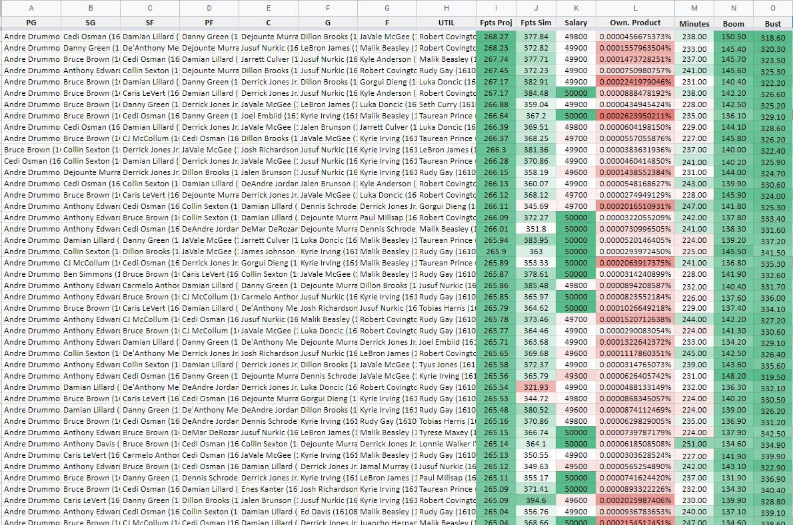

# NBA Optimizer and GPP Utilities
Packaged in this repository is an NBA optimzier for DraftKings and FanDuel, along with other tools you might find useful in helping you win your Cash games, Head-to-heads and Tournaments. You'll find installation and usage instructions below

## Installation
### System requirements
- To run the tools, you will need to [install python](https://www.python.org/downloads/) if you don't already have it. These tools were bult on Python 3.8.2, and may be incompatible with outdated versions of Python.
- In addition to the base python installation, you will need the following packages:
    - [PuLP](https://pypi.org/project/PuLP/) - `pip install pulp`. This is the linear programming solver - the "optimizer" if you will.
    - [timedelta](https://pypi.org/project/timedelta/) - `pip install timedelta`. This package makes it easy to interpret dates for late swaptimizing lineups.
    - [numpy](https://pypi.org/project/numpy/) - `pip install numpy`. This package makes data manipulation and handling matrices easier.

To install these tools, you may either clone this repository or download the repository as a ZIP file (see image below) and extract it to the directory of your choosing.
    

After you have cloned or downloaded the code base, you must import player contest data from DraftKings or FanDuel. Reference the screenshots below for your relative site. You will need to rename these files to `player_ids.csv`, and place into their relative directory (`dk_data/` or `fd_data/`)

After you have the player data, you must import data from Awesemo, namely the projections, ownership, boom/bust tool. Download them as CSV, and rename them to match the image below. These will go in either `dk_data/` or `fd_data/` depending on which data you downloaded.

## Usage
To use the tools, you will need to open a windows console or powershell terminal in the same directory as this repository. To do this, go to the root directory and then navigate to `File > Open Windows Powershell` as seen below.

To run the tools, the generic usage template is as follows:
`python .\main.py <site> <process> <num_lineups> <num_uniques> <use_rand>`

Where:
`<site>` is:
- `dk` for DraftKings. Note for DraftKings, players are output in alphabetical order and must be re-ordered into their positions before uploading back to DK.
- `fd` for FanDuel. Note for FanDuel, you must also run `python .\name_change.py` before any crunching, as some player names differ between Awesemo projections and FanDuel's player data

`<process>` is: 
- `opto` for running optimal lineup crunches, with or without randomness
- `sim` for running GPP simulations
    - Note you will need to provide extra arguments for this - `python .\main.py <site> sim <field_size> <num_iterations>`, where `<field_size>` is the known entrant size, and `<num_iterations>` is the number of times you wish to 

`<num_lineups>` is the number of lineups you want to generate when using the `opto` process.

`<num_uniques>` defines the number of players that must differ from one lineup to the next. **NOTE** - this is enforced *after* crunching, so 1000 lineups may be whittled down to 7-800 depending on this constraint. Enforcing this *after* crunching aids in the speed of crunching. Expect approximately 5-15% of lineups to be "culled" by this constraint and plan accordingly. The more players available to crunch, the lower this percentage will be.

`<use_randomess>` is:
- `rand` if you want to incorporate [Standard Normal](https://www.mathsisfun.com/data/standard-normal-distribution.html) randomness
- `none` (or any string that isn't 'rand') if you want to crunch strict optimals with no randomness added.

For example, to generate 1000 lineups for DraftKings, with 3 uniques and randomness, I would execute the following:
`python .\main.py dk opto 1000 3 rand`

The image below shows what the shell/terminal should look like when executing this. You may safely ignore the PuLP overwriting warning, as we must overwrite the linear programming objective with the updated random projections.

## Output
Data is stored in the `output/` directory. Note that subsequent runs of the tool will overwrite previous output files, so either move them or rename them if you wish to preseve them. From there, you may upload these `.csv` files into Excel, and "pretty them up" - this can be seen below 

